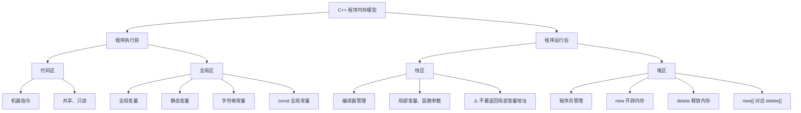

---
tags:
  - C++/内存
  - C++/核心
date: 2026-07-31
---

# 01~05 程序的内存模型

C++ 程序在执行时，将内存划分为 **四个区域**，不同区域存放的数据具有不同的生命周期和作用域。

![[../图片/Pasted image 20260731112505.png]]

## 内存分区总览

| 内存区域 | 管理方式 | 存放内容 | 生命周期 |
|:---------|:---------|:---------|:---------|
| 代码区 | 操作系统 | CPU 执行的机器指令 | 程序运行期间 |
| 全局区 | 操作系统 | 全局变量、静态变量、常量 | 程序运行期间 |
| 栈区 | 编译器 | 局部变量、函数参数 | 函数/代码块执行期间 |
| 堆区 | 程序员 | `new` 开辟的数据 | 程序员手动释放或程序结束 |

---

## 一、程序执行前

在程序编译生成 `.exe` 可执行文件后、尚未运行时，代码区和全局区就已经确定了。

### 1.1 代码区

![[../图片/Pasted image 20260731113815.png]]

- 存放 CPU 执行的**机器指令**（二进制代码）
- **共享**：一份代码可以被多次执行（方便多进程共享）
- **只读**：防止程序意外修改指令，保证安全性

### 1.2 全局区

![[../图片/Pasted image 20260731115711.png]]

全局区存放以下数据：

| 类型 | 示例 |
|:-----|:-----|
| **全局变量** | 在函数体外定义的变量 |
| **静态变量** | 使用 `static` 关键字修饰的变量 |
| **字符串常量** | 如 `"hello world"` |
| **`const` 修饰的全局常量** | 全局 `const` 变量 |

> [!note] 注意
> - 该区域的数据在程序结束后由**操作系统自动释放**。
> - **局部变量**和 **`const` 修饰的局部常量**不在全局区。

```cpp
#include <iostream>
using namespace std;

// 全局变量 → 全局区
int g_a = 10;
int g_b = 10;

// const 修饰的全局变量 → 全局区（常量区）
const int c_g_a = 10;

int main() {
    // 局部变量 → 不在全局区
    int a = 10;

    // 静态变量 → 全局区
    static int s_a = 10;

    // 字符串常量 → 全局区
    cout << "hello world" << endl;

    // const 修饰的局部变量 → 不在全局区
    const int c_a = 10;

    cout << "局部变量 a 的地址: " << &a << endl;
    cout << "全局变量 g_a 的地址: " << &g_a << endl;
    cout << "静态变量 s_a 的地址: " << &s_a << endl;
    cout << "字符串常量地址: " << &"hello world" << endl;
    cout << "const 全局常量 c_g_a 地址: " << &c_g_a << endl;

    return 0;
}
```

> 观察输出可知：全局变量、静态变量、字符串常量、`const` 全局常量的地址非常相近，说明它们都在**全局区**。

---

## 二、程序运行后

程序开始执行后，会动态开辟栈区和堆区。

### 2.1 栈区

![[../图片/Pasted image 20260731115852.png]]

栈区由**编译器自动管理**，分配和释放由系统完成。

| 存放内容 | 说明 |
|:---------|:-----|
| **局部变量** | 函数体内定义的变量 |
| **函数参数** | 函数的形参 |

> [!warning] 核心注意事项
> **不要返回局部变量的地址**。函数执行完毕后，栈区数据会被自动释放，返回其地址将导致**悬空指针**（野指针）。

```cpp
#include <iostream>
using namespace std;

// ❌ 错误示例：返回局部变量地址
int* func() {
    int a = 10;        // 局部变量，存放在栈区
    return &a;         // 返回局部变量地址（危险！）
}

// ✅ 正确示例：返回局部变量的值
int funcSafe() {
    int a = 10;
    return a;          // 返回的是值的拷贝，安全
}

int main() {
    // 错误做法
    int* p = func();   // p 指向已被释放的内存
    cout << *p << endl; // 第一次可能侥幸读到 10（编译器保留）
    cout << *p << endl; // 第二次数据可能已被覆盖，结果未知

    return 0;
}
```

> [!tip] 为什么第一次可能读到正确值？
> 函数返回后，栈上的数据**不会立刻清零**，只是标记为"可覆盖"。第一次读取时数据可能还在，但第二次读取前可能被其他操作覆盖。

### 2.2 堆区

![[../图片/Pasted image 20260731140919.png]]

堆区由**程序员手动管理**。程序员负责分配和释放内存；如果程序结束时仍未释放，操作系统会**自动回收**。

#### `new` 关键字 —— 在堆区开辟内存

![[../图片/Pasted image 20260731141322.png]]

```cpp
#include <iostream>
using namespace std;

int* func() {
    // new 在堆区开辟一块 int 大小的内存
    // 返回这块内存的地址
    int* p = new int(10);
    return p;  // p 是局部变量（在栈区），但它指向堆区的地址
               // 返回的是地址值的拷贝，堆区数据不会被释放
}

int main() {
    int* p = func();
    cout << *p << endl; // 10
    cout << *p << endl; // 10（堆区数据稳定存在）
    return 0;
}
```

> 这里的 `p` 本身在栈区，但它指向堆区——关键是**堆区的数据不会随函数结束而释放**。

#### `delete` 关键字 —— 释放堆区内存

![[../图片/Pasted image 20260731141713.png]]

使用 `delete` 手动释放堆区内存，防止**内存泄漏**。

```cpp
#include <iostream>
using namespace std;

int* func() {
    // 在堆区创建整型变量
    int* p = new int(10);
    return p;
}

// 在堆区创建数组
void test() {
    int* arr = new int[10]; // 创建有 10 个元素的数组
    for (int i = 0; i < 10; i++) {
        arr[i] = i + 100;
    }
    for (int i = 0; i < 10; i++) {
        cout << arr[i] << " ";
    }
    cout << endl;

    // 释放数组：必须加 []
    delete[] arr;
}

int main() {
    // 单个变量
    int* p = func();
    cout << *p << endl; // 10
    delete p;           // 释放堆区内存
    // cout << *p << endl; // ❌ 不可再访问！p 已是悬空指针

    // 数组
    test();

    return 0;
}
```

![[../图片/Pasted image 20260731142526.png]]

![[../图片/Pasted image 20260731142541.png]]

> [!important] 内存管理原则
> - 用 `new` 分配的内存，**必须**用 `delete` 释放
> - 用 `new type[]` 分配的数组，**必须**用 `delete[]` 释放
> - 释放后将指针置为 `nullptr`，避免悬空指针

---

## 三、总结



| 比较项 | 栈区 | 堆区 |
|:-------|:-----|:-----|
| 管理者 | 编译器 | 程序员 |
| 分配方式 | 自动分配 | `new` |
| 释放方式 | 自动释放（函数结束） | `delete` 手动释放 |
| 大小限制 | 较小（通常几 MB） | 较大（受系统内存限制） |
| 访问速度 | 快 | 较慢 |
| 内存碎片 | 不会产生 | 可能产生 |
| 生命周期 | 函数/代码块执行期间 | 程序员控制 |

---

> **参考视频**：黑马程序员 C++ 教程 —— 程序的内存模型
