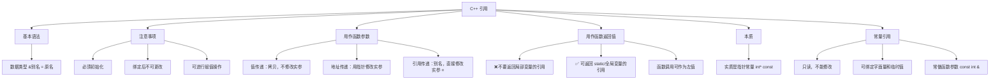

---
tags:
date: 2026-08-03
---
 
# 06~11 C++ 中的引用

**引用**是 C++ 相对于 C 语言新增的重要特性，它为变量提供了**别名**，使得操作引用就如同操作原变量本身。

---

## 一、引用的基本语法

![[../图片/Pasted image 20260803103749.png]]

```cpp
数据类型 &别名 = 原名;
```

```cpp
int a = 10;
int &b = a;   // b 就是 a 的别名（引用）

cout << "a = " << a << endl;  // 10
cout << "b = " << b << endl;  // 10

b = 20;       // 修改 b 等同于修改 a
cout << "a = " << a << endl;  // 20
cout << "b = " << b << endl;  // 20
```

> 引用在语法上是**别名**——对引用的任何操作，都是对原变量的操作。

---

## 二、引用的注意事项

![[../图片/Pasted image 20260803105521.png]]

### 2.1 必须初始化

```cpp
int &b;       // ❌ 错误！引用必须初始化
int a = 10;
int &b = a;   // ✅ 正确
```

### 2.2 一旦绑定，不可更改

引用在初始化后**不能再改变其绑定对象**（它终生是那个变量的别名）。

```cpp
int a = 10;
int c = 20;
int &b = a;

b = c;        // 这不是让 b 变成 c 的引用
              // 而是把 c 的值赋给 b（也就是 a）
              // 结果：a = 20, c = 20, b 依然引用 a
```

> [!important] 关键区别
> `b = c;` 是**赋值操作**，不是更改引用绑定。它相当于 `a = c;`。

### 2.3 可以进行赋值操作

引用一旦初始化后，可以像普通变量一样**赋值**——赋值操作会修改原变量的值。

---

## 三、引用做函数参数

![[../图片/Pasted image 20260803111038.png]]

![[../图片/Pasted image 20260803111621.png]]

### 3.1 值传递 vs 地址传递 vs 引用传递

| 传递方式 | 形参加深 | 是否修改实参 | 优点 |
|:---------|:---------|:-------------|:-----|
| **值传递** | 拷贝一份数据 | ❌ 不修改 | 安全，不影响原数据 |
| **地址传递** | 拷贝指针 | ✅ 通过指针修改 | 节省内存 |
| **引用传递** | 不拷贝，起别名 | ✅ 直接修改 | 写法简洁，像值传递一样自然 |

```cpp
#include <iostream>
using namespace std;

// 1. 值传递 —— 不修改实参
void swap_value(int a, int b) {
    int temp = a;
    a = b;
    b = temp;
}

// 2. 地址传递 —— 修改实参
void swap_pointer(int* a, int* b) {
    int temp = *a;
    *a = *b;
    *b = temp;
}

// 3. 引用传递 —— 修改实参，写法最简洁
void swap_ref(int &a, int &b) {
    int temp = a;
    a = b;
    b = temp;
}

int main() {
    int x = 10, y = 20;

    swap_value(x, y);
    cout << x << " " << y << endl;  // 10 20（未交换）

    swap_pointer(&x, &y);
    cout << x << " " << y << endl;  // 20 10（已交换）

    swap_ref(x, y);
    cout << x << " " << y << endl;  // 10 20（再次交换）

    return 0;
}
```

> 引用传递**兼具值传递的写法简洁**和**地址传递的修改实参能力**，是最推荐的参数传递方式之一。

---

## 四、引用做函数返回值

![[../图片/Pasted image 20260803112644.png]]

### 4.1 不要返回局部变量的引用

```cpp
#include <iostream>
using namespace std;

// ❌ 错误：返回局部变量的引用
int& test01() {
    int a = 10;    // a 是局部变量，存放在栈区
    return a;      // 函数结束 a 被释放，引用指向无效内存
}

// ✅ 正确：返回静态变量的引用
int& test02() {
    static int a = 10;  // static 变量在全局区，不会随函数结束释放
    return a;
}

int main() {
    int &ref = test02();
    cout << ref << endl;  // 10
    cout << ref << endl;  // 10（稳定，数据未被覆盖）
    return 0;
}
```

> [!warning] 规则
> 可以返回静态变量或全局变量的引用，但**绝对不能**返回局部变量的引用。

### 4.2 函数调用作为左值

![[../图片/Pasted image 20260803115317.png]]

如果函数的返回值是引用，那么**函数调用本身可以作为左值**进行赋值操作。

```cpp
#include <iostream>
using namespace std;

int& test02() {
    static int a = 10;
    return a;
}

int main() {
    test02() = 1000;  // 等价于将 a 赋值为 1000
    cout << test02() << endl;  // 1000
    return 0;
}
```

> 当返回引用时，`test02()` 返回的就是 `a` 本身（的别名），因此可以放在赋值号左侧当左值使用。

---

## 五、引用的本质

![[../图片/Pasted image 20260803115424.png]]

引用的本质是 C++ 内部的一个**指针常量**：

```cpp
// 引用在底层等价于：
int &ref = a;
// 等价于：
int* const ref = &a;  // 指针常量：指向不可改变
```

| 比较项 | 引用 `int &ref = a` | 指针常量 `int* const p = &a` |
|:-------|:---------------------|:------------------------------|
| 初始化 | 必须初始化 | 必须初始化 |
| 指向 | 不可更改 | 不可更改（`p = &b` ❌） |
| 修改值 | `ref = 100` | `*p = 100` |
| 语法 | 像普通变量 | 需要 `*` 解引用 |

```cpp
int a = 10;
int &ref = a;    // C++ 推荐写法
ref = 20;        // 自动解引用，修改 a

// 底层等价于：
// int* const ref = &a;
// *ref = 20;
```

> [!summary] 一句话总结
> 引用的实质是**指针常量**，指针的指向不能改，但指向的值可以修改。引用语法让程序员不需要手动解引用，让代码更简洁直观。

---

## 六、常量引用

![[../图片/Pasted image 20260803120050.png]]

![[../图片/Pasted image 20260803120722.png]]

### 6.1 基本用法

常量引用用 `const` 修饰，通过常量引用**只能读取数据，不能修改数据**。

```cpp
int a = 10;
const int &ref = a;   // 常量引用

// ref = 20;          // ❌ 错误！常量引用不能修改
cout << ref << endl;  // ✅ 可以读取，输出 10

a = 30;               // ✅ 通过原变量仍可修改
cout << ref << endl;  // 30
```

### 6.2 常量引用的使用场景

#### （1）修饰函数参数，防止误修改

```cpp
void showValue(const int &val) {
    // val = 100;     // ❌ 编译错误！防止误修改
    cout << val << endl;  // ✅ 只读操作
}
```

#### （2）绑定字面量和临时值

```cpp
// 普通引用不能绑定字面量
// int &ref = 10;        // ❌ 错误！10 是字面量

// 常量引用可以绑定字面量
const int &ref = 10;     // ✅ 合法
// 底层等价于：int temp = 10; const int &ref = temp;
```

> 编译器会创建一个**临时变量**（`temp`），然后让 `const` 引用指向这个临时变量。

#### （3）接收函数返回值，避免拷贝

```cpp
// 返回一个较大的结构体时，用常量引用接收，避免不必要的拷贝
struct BigData { int arr[1000]; };

BigData getData();

const BigData &data = getData();  // 延长了临时对象的生命周期
```

---

## 总结



| 特性 | 引用 | 指针 |
|:-----|:-----|:-----|
| 是否必须初始化 | ✅ 必须 | ❌ 可以不初始化（危险） |
| 能否为 NULL | ❌ 不能 | ✅ 可以 |
| 绑定/指向能否改变 | ❌ 不能 | ✅ 能（非 `* const`） |
| 解引用语法 | 不需要（直接写） | 需要 `*` 操作符 |
| 对数组操作 | 不直接支持 | 支持 |
| 有多级（二级引用） | ❌ 不支持 | ✅ 支持（`int**`） |
| sizeof 含义 | 原类型大小 | 指针本身大小 |
| 函数参数推荐程度 | ⭐ 强烈推荐 | 功能相同但写法略繁琐 |

> [!tip] 使用建议
> - 能使用引用时**优先使用引用**，语法更简洁、更安全（不会为空）
> - 只读场景使用 **`const &`**，避免误修改且可以接收临时值

---

> **参考视频**：黑马程序员 C++ 教程 —— C++ 中的引用
