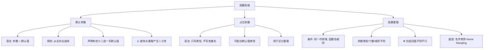

---
tags:
  - C++/函数
  - C++/核心
date: 2026-08-06
---

# 12~15 函数高级

C++ 在 C 语言的基础上对函数做了三项重要扩展：**默认参数**、**占位参数**和**函数重载**。

---

## 一、函数的默认参数

> 在函数声明或定义时，可以为参数指定**默认值**。调用函数时，如果不传递对应参数，则使用默认值。

![[Pasted image 20260806152851.png]]

### 1.1 基本语法

```cpp
// 语法
返回值类型 函数名(参数1 = 默认值1, 参数2 = 默认值2, ...) { ... }
```

```cpp
#include <iostream>
using namespace std;

// 定义时设置默认参数
int add(int a, int b = 20, int c = 30) {
    return a + b + c;
}

int main() {
    cout << add(10) << endl;        // 10 + 20 + 30 = 60
    cout << add(10, 5) << endl;     // 10 + 5  + 30 = 45
    cout << add(10, 5, 3) << endl;  // 10 + 5  + 3  = 18
    return 0;
}
```

### 1.2 默认参数的规则

![[Pasted image 20260806152942.png]]

#### 规则一：默认参数必须从右向左连续

```cpp
// ✅ 正确：默认参数在右侧
void func1(int a, int b = 10, int c = 20) { }

// ✅ 正确：只有最右侧有默认值
void func2(int a, int b, int c = 30) { }

// ❌ 错误：默认参数中间有间隔（不连续）
void func3(int a = 10, int b, int c) { }
void func4(int a, int b = 10, int c) { }
```

> [!important] 核心规则
> 默认参数只能**从右向左**依次定义，**不能跳跃**。

#### 规则二：声明和定义只能有一处写默认参数

![[Pasted image 20260806153202.png]]

```cpp
#include <iostream>
using namespace std;

// ==================== 情况 1：声明处写，定义处不写 ====================

// 声明
int add(int a, int b = 20, int c = 30);

// 定义（不重复写默认值）
int add(int a, int b, int c) {
    return a + b + c;
}

// ==================== 情况 2：定义处写，声明处不写 ====================

// 声明（不写默认值）
int sub(int a, int b, int c);

// 定义
int sub(int a, int b = 20, int c = 30) {
    return a - b - c;
}

// ❌ 错误：两处都写会冲突！
// int multiply(int a, int b = 10, int c = 10);
// int multiply(int a, int b = 10, int c = 10) { return a * b * c; }
```

> [!tip] 最佳实践
> 如果同时有声明和定义，**在声明处写默认参数**，定义处不写。这样阅读代码时就能看到默认值。

#### 规则三：传入的参数按顺序匹配

```cpp
void func(int a, int b = 10, int c = 20) { }

func(1);          // a=1, b=10, c=20
func(1, 2);       // a=1, b=2,  c=20
func(1, 2, 3);    // a=1, b=2,  c=3

// ❌ 不能跳过 b 给 c 赋值
// func(1, , 3);  // 语法错误！C++ 不支持命名参数
```

---

## 二、函数的占位参数

![[Pasted image 20260806153409.png]]

### 2.1 基本语法

```cpp
// 语法：只写数据类型，不写参数名
返回值类型 函数名(数据类型) { ... }
```

```cpp
#include <iostream>
using namespace std;

// 占位参数：只写 int，不写变量名
void func(int a, int) {
    cout << "func called with a = " << a << endl;
}

int main() {
    func(10, 20);  // 必须传递两个参数，即使第二个用不到
    // func(10);   // ❌ 错误！缺少第二个参数
    return 0;
}
```

### 2.2 占位参数也可以有默认值

```cpp
#include <iostream>
using namespace std;

// 占位参数 + 默认值
void func(int a, int = 10) {
    cout << "func called with a = " << a << endl;
}

int main() {
    func(100);       // ✅ 占位参数有默认值，可以不传
    func(100, 200);  // ✅ 也可以手动传入
    return 0;
}
```

### 2.3 占位参数的作用

| 作用 | 说明 |
|:-----|:-----|
| **配合函数重载** | 用占位参数区分重载版本 |
| **参数占位** | 预留位置，方便后续扩展 |
| **兼容旧代码** | 旧接口需要更多参数但新实现用不到 |

```cpp
// 通过占位参数区分重载
void step(int n);         // 无占位
void step(int n, int);    // 有占位参数 → 不同的重载版本
```

> [!note] 注意
> 占位参数在 C 语言中也有，但在 C++ 中主要配合函数重载和默认参数使用，增强了函数的灵活性。

---

## 三、函数重载

> **函数重载**是 C++ 的多态特性之一，允许用同一个函数名定义多个函数，通过不同的参数列表来区分。

### 3.1 基本语法

![[Pasted image 20260806153637.png]]

```cpp
#include <iostream>
using namespace std;

// 同一个函数名，不同的参数类型
void print(int a) {
    cout << "int: " << a << endl;
}

void print(double a) {
    cout << "double: " << a << endl;
}

void print(string a) {
    cout << "string: " << a << endl;
}

int main() {
    print(10);           // 调用 print(int)
    print(3.14);         // 调用 print(double)
    print("hello");      // 调用 print(string)
    return 0;
}
```

### 3.2 函数重载的条件

**同一个作用域内**，函数名相同，满足以下**任一**条件即可：

| 条件 | 示例 |
|:-----|:-----|
| **参数的类型不同** | `func(int)` vs `func(double)` |
| **参数的个数不同** | `func(int)` vs `func(int, int)` |
| **参数的顺序不同** | `func(int, double)` vs `func(double, int)` |

```cpp
// ==================== 参数类型不同 ====================
void func(int a) { }
void func(double a) { }

// ==================== 参数个数不同 ====================
void func(int a) { }
void func(int a, int b) { }

// ==================== 参数顺序不同 ====================
void func(int a, double b) { }
void func(double a, int b) { }

func(10);           // 调用 func(int)
func(3.14);         // 调用 func(double)
func(10, 20);       // 调用 func(int, int)
func(10, 3.14);     // 调用 func(int, double)
func(3.14, 10);     // 调用 func(double, int)
```

### 3.3 返回值不同不能作为重载条件

```cpp
// ❌ 错误！仅返回值不同不算重载
int func(int a) {
    return a;
}

double func(int a) {   // 编译错误！与上面的函数冲突
    return a * 1.0;
}
```

> [!important] 关键点
> **函数重载只看参数列表**，不看返回值。编译器通过参数列表决定调用哪个函数，返回值类型无法区分。

### 3.4 重载与默认参数的冲突

当函数重载遇上默认参数时，可能出现**二义性**：

```cpp
// ⚠️ 二义性示例
void func(int a, int b = 10) {
    cout << "version 1" << endl;
}

void func(int a) {
    cout << "version 2" << endl;
}

int main() {
    // func(10);  // ❌ 二义性错误！
    // 编译器不知道调用 func(int, int = 10) 还是 func(int)
    return 0;
}
```

> [!warning] 避免方案
> 设计函数时，避免让**带默认参数的函数**和**相兼容的重载版本**同时存在。

### 3.5 函数重载的底层原理

编译器在编译时，会对重载函数进行**名字修饰（Name Mangling）**，将函数名按参数类型编码，生成不同的内部名称：

```cpp
// 编译前（源代码）
void func(int a, double b);
void func(double a, int b);

// 编译后（内部名称，示意）
// _Z4funcid    → func(int, double)
// _Z4funcdi    → func(double, int)
```

> 这也是为什么 C 语言不支持函数重载 —— C 编译器不进行名字修饰。

### 3.6 const 引用与函数重载

```cpp
#include <iostream>
using namespace std;

// 普通引用版本
void show(int &a) {
    cout << "non-const ref: " << a << endl;
}

// const 引用版本
void show(const int &a) {
    cout << "const ref: " << a << endl;
}

int main() {
    int x = 10;
    const int y = 20;

    show(x);        // 调用普通引用版本
    show(y);        // 调用 const 引用版本
    show(30);       // 调用 const 引用版本（字面量只能绑定 const&）

    return 0;
}
```

---

## 总结



| 特性 | C | C++ |
|:-----|:--|:----|
| 默认参数 | ❌ 不支持 | ✅ 支持 |
| 占位参数 | ✅ 支持 | ✅ 支持（可加默认值） |
| 函数重载 | ❌ 不支持（需要不同函数名） | ✅ 支持 |

---

## 🎯 课后练习

### 练习 1：默认参数

```cpp
// ① 编写函数 sum，三个参数 a, b, c，给 b 默认值 20，c 默认值 30
// ② 在 main 中分别用 1 个、2 个、3 个参数调用 sum，输出结果
// ③ 尝试让默认参数不连续（如 a 有默认值，b 没有），观察编译错误
```

### 练习 2：占位参数

```cpp
// ① 编写一个包含占位参数的函数 void greet(string name, int)
// ② 在 main 中调用并传递占位参数的值
// ③ 给占位参数添加默认值，测试不传占位参数的调用
```

### 练习 3：函数重载

```cpp
// ① 重载 max 函数：分别支持两个 int、两个 double、三个 int
// ② 验证仅返回值不同不能构成重载（编写代码观察编译报错）
// ③ 写一个二义性示例（默认参数 + 重载冲突）
```

### 练习 4：综合

```cpp
// 设计一个日志输出函数组：
// log(int code)              → 输出: "[ERROR] code: xxx"
// log(string msg)            → 输出: "[INFO] xxx"
// log(string msg, int code)  → 输出: "[WARN] xxx (code: xxx)"
// 其中 log(string, int) 给 code 默认值 0
// 注意避免与 log(int) 产生二义性
```

---

> **参考视频**：黑马程序员 C++ 教程 —— 函数高级
